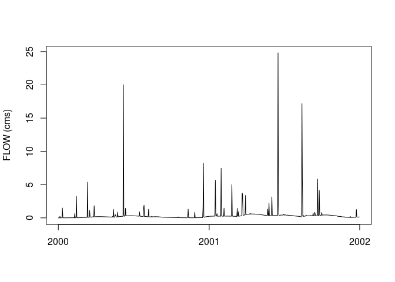

<!-- README.md is generated from README.Rmd. Please edit that file -->
swatr
=====

This package adds documentation to the `SWATmodel` package and reproduces some of the model setup functionality of the `QSWAT` qgis plugin.

Installation
------------

You can install swatr from github with:

``` r
# install.packages("devtools")
devtools::install_github("jsta/swatr")
```

Usage
-----

``` r
library(swatr)

build_swat_basic("test")
#> [1] "test/000010000.pnd"
#> [1] "test/000010000.rte"
#> [1] "test/000010000.sub"
#> [1] "test/000010000.swq"
#> [1] "test/000010000.wgn"
#> [1] "test/000010000.wus"
#> [1] "test/000010001.chm"
#> [1] "test/000010001.gw"
#> [1] "test/000010001.hru"
#> [1] "test/000010001.mgt"
#> [1] "test/000010001.sol"
#> [1] "test/000010002.chm"
#> [1] "test/000010002.gw"
#> [1] "test/000010002.hru"
#> [1] "test/000010002.mgt"
#> [1] "test/000010002.sol"
#> [1] "test/000010003.chm"
#> [1] "test/000010003.gw"
#> [1] "test/000010003.hru"
#> [1] "test/000010003.mgt"
#> [1] "test/000010003.sol"
#> [1] "test/000020000.pnd"
#> [1] "test/000020000.rte"
#> [1] "test/000020000.sub"
#> [1] "test/000020000.swq"
#> [1] "test/000020000.wgn"
#> [1] "test/000020000.wus"
#> [1] "test/000020001.chm"
#> [1] "test/000020001.gw"
#> [1] "test/000020001.hru"
#> [1] "test/000020001.mgt"
#> [1] "test/000020001.sol"
#> [1] "test/000020002.chm"
#> [1] "test/000020002.gw"
#> [1] "test/000020002.hru"
#> [1] "test/000020002.mgt"
#> [1] "test/000020002.sol"
#> [1] "test/000020003.chm"
#> [1] "test/000020003.gw"
#> [1] "test/000020003.hru"
#> [1] "test/000020003.mgt"
#> [1] "test/000020003.sol"
#> [1] "test/000030000.pnd"
#> [1] "test/000030000.rte"
#> [1] "test/000030000.sub"
#> [1] "test/000030000.swq"
#> [1] "test/000030000.wgn"
#> [1] "test/000030000.wus"
#> [1] "test/000030001.chm"
#> [1] "test/000030001.gw"
#> [1] "test/000030001.hru"
#> [1] "test/000030001.mgt"
#> [1] "test/000030001.sol"
#> [1] "test/000030002.chm"
#> [1] "test/000030002.gw"
#> [1] "test/000030002.hru"
#> [1] "test/000030002.mgt"
#> [1] "test/000030002.sol"
#> [1] "test/000030003.chm"
#> [1] "test/000030003.gw"
#> [1] "test/000030003.hru"
#> [1] "test/000030003.mgt"
#> [1] "test/000030003.sol"
#> [1] "test/basins.bsn"
#> [1] "test/basins.wwq"
#> [1] "test/crop.dat"
#> [1] "test/fert.dat"
#> [1] "test/fig.fig"
#> [1] "test/file.cio"
#> [1] "test/pcp1.pcp"
#> [1] "test/pest.dat"
#> [1] "test/till.dat"
#> [1] "test/tmp1.tmp"
#> [1] "test/urban.dat"
setwd("test")
res <- runSWAT2012(".")

plot(res$mdate, res$FLOW_OUTcms, type = "l", xlab = "", ylab = "FLOW (cms)")
```


